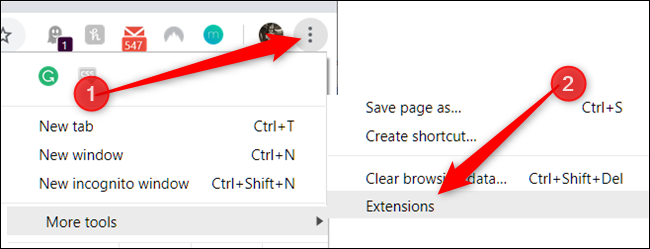
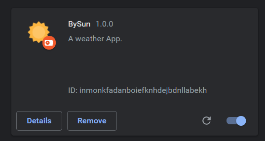
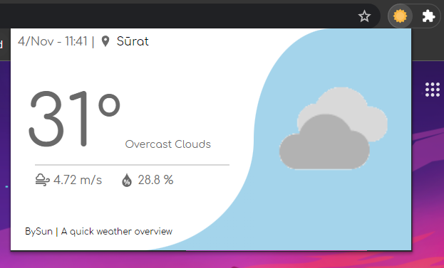

# BySun

## What is it ?

A simple and quick weather widget as a **Chrome Extension**.

## How to Use :

1. Download this repo in your Local-Machine then extract it.

2. Then open **Extension Manager** in **Chrome Browser**.
   

3. Enable **Developer Mode** then select **Load Unpacked** and browse the **extracted** folder.
   (make sure all the repo files are present inside the folder)
   

4. Then you will see this extension in the list.
   

5. Then just **pin** this extension and everytime you click you will see a live weather update like this.
   

## Features :

- Built using,
  - HTML
  - CSS
  - Vanila JS
  - [Geolocation API](https://developers.google.com/maps/documentation/geolocation/overview) (To retrieve the coordinates of the user in order to get accurate weather)
  - [Weatherbit API](https://www.weatherbit.io/) (An online API to get current weather detais of the given location.)
- Detailed Weather Update.
  - Date & Time
  - Current Location
  - Temprature (in ॰C)
  - Weather Description
  - Wind Speed (in m/s)
  - Relative Humidity (in %)
  - Icon related to the current weather.
- Attractive and Dynamic UI.
- Easy to use.
